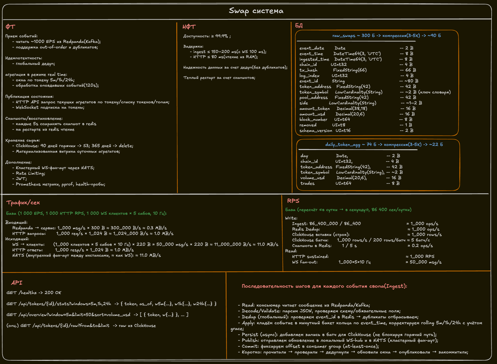

# Swap Stats — Implementation Guide

---
## Requirements
You have 1000 swaps per second from the producer (who, token, amount, USD, party, etc.).
The producer also stores this data in a database.

You need to create a system that calculates token statistics in real time (5-minute volume, 1-hour volume, 24-hour volume, number of transactions, etc.)
and serves this data via an HTTP API and WebSocket updates with minimal latency.

The system must be highly available and handle restarts without data loss or missed events during startup.
It must be scalable so we can launch more instances.
Swap data may contain duplicates, and block ordering is not guaranteed.

1. Theoretical Problem. Design the complete architecture.
- What transport mechanisms would you use from the producer?
- Where would you store the different types of data?
- How would you ensure high availability and zero data loss?

2. Practical task. Implement a Go service that:
- reads swap events from a channel
- calculates statistics
- serves data over HTTP
- sends updates to a WebSocket channel
- handles restarts.
- Use storage interfaces.

---

