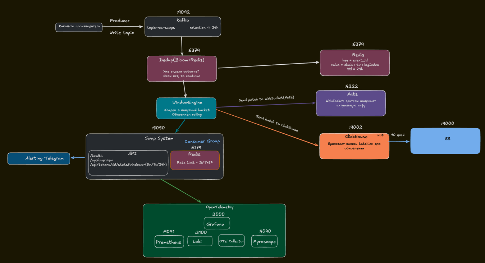

# Swap Stats — Implementation Guide

# Author: Poplaukhin Dima 
## **telegram - @nevasik**

> Goal: build a real-time swap aggregation service (1000 EPS) step by step and clearly, with low latency, High Availability, dedupe, sliding windows, snapshots, and delivery via HTTP/WS/gRPC.

> By default we use Redpanda (Kafka API), but keep a quick switch to Apache Kafka.

---

## 📦 Postman Collection

A ready-made Postman collection with automatic JWT token propagation is available for API testing:

- **[Dexcelerate_API.postman_collection.json](postman/Dexcelerate_API.postman_collection.json)** — Full collection of all endpoints
- **[Dexcelerate_Local.postman_environment.json](postman/Dexcelerate_Local.postman_environment.json)** — Environment for local development
- **[Dexcelerate_Staging.postman_environment.json](postman/Dexcelerate_Staging.postman_environment.json)** — Environment for staging
- **[POSTMAN_GUIDE.md](POSTMAN_GUIDE.md)** — Detailed usage instructions

### Quick start with Postman:

1. Import the collection and environment files into Postman
2. Select the **Dexcelerate Local** environment
3. Run **Public Endpoints → Mint JWT Token**
4. The token will be saved automatically and used in all protected endpoints

More details: [POSTMAN_GUIDE.md](POSTMAN_GUIDE.md)

---

## Table of Contents
1. [Requirements](#requirements)
2. [Overview](#overview)
3. [Technology Stack](#technology-stack)
4. [Glossary (simple terms)](#glossary-simple-terms)
5. [Architecture & Data Flows](#architecture--data-flows)
6. [Local Stand (Docker Compose)](#local-stand-docker-compose)
7. [Service Configuration (`config.yaml`)](#service-configuration-configyaml)
8. [Data & Domain Models](#data--domain-models)
9. [Deduplication (Dedup)](#deduplication-dedup)
10. [Window Engine: ring buffers + rolling sums + grace](#window-engine-ring-buffers--rolling-sums--grace)
11. [Snapshots (Snapshot/Restore)](#snapshots-snapshotrestore)
12. [Ingest from Redpanda/Kafka](#ingest-from-redpandakafka)
13. [Long-term Storage: ClickHouse + Daily MVs](#longterm-storage-clickhouse--daily-mvs)
14. [HTTP API + JWT + Rate Limiting](#http-api--jwt--rate-limiting)
15. [WebSocket + coalescing + cluster fan-out (NATS)](#web-socket-+-coalescing-+-cluster-fan-out-(NATS))
16. [Observability: metrics & pprof](#observability-metrics--pprof)
17. [Switching Redpanda ⇄ Kafka](#switching-redpanda--kafka)
18. [Test Plan (unit/integration/load)](#test-plan-unitintegrationload)
19. [Runbook (operational rules)](#runbook-operational-rules)
20. [Quick Start (commands)](#quick-start-commands)
21. [How PROD config will differ from current dev](#how-prod-config-will-differ-from-current-dev)

--- 
## Requirements
You have 1000 swaps per second from a producer (who, token, amount, USD, side, etc.).  
The producer also stores this data in a database.

You need to create a system that computes token statistics in real time (volume over 5 minutes, 1 hour, 24 hours, number of transactions, etc.)
and serves this data via an HTTP API and WebSocket updates with minimal latency.

The system must be highly available and handle restarts without losing data or skipping events during startup.
It must be horizontally scalable so we can run more instances.
Swap data may contain duplicates, and block order is not guaranteed.

1. Theoretical task. Design the full architecture.
   - What transport mechanisms would you use from the producer?
   - Where would you store different data types?
   - How would you ensure high availability and no data loss?

2. Practical task. Implement a Go service that:
   - reads swap events from a stream
   - computes statistics
   - serves data over HTTP
   - sends updates via WebSocket
   - handles restarts
   - Uses interfaces for storage.


---

## Overview

We are building a service that:

* ingests ~**1000 events/sec** (EPS),
* computes **sliding windows** per token: 5m / 1h / 24h,
* **filters duplicates** (dedupe),
* correctly handles **late events** (grace),
* stores raw data in **ClickHouse** for 90 days,
* serves state via **HTTP** and **WebSocket** with minimal latency,
* survives restarts without recomputing a day of history — using **snapshots**,
* scales horizontally with High Availability.

---

## Technology Stack

* **Broker:** Redpanda (Kafka API). Ability to switch to Apache Kafka.
* **Stores:** Redis (dedupe, snapshots, rate-limit), ClickHouse (raw), NATS (cluster fan-out for WS).
* **Cold storage:** S3/MinIO (ClickHouse storage policy: HOT → COLD(S3)).
* **Core:** Go 1.22+, chi (HTTP), nhooyr/websocket (WS), custom logger wrapper (zerolog) + alert manager to Telegram API.
* **Metrics:** Prometheus, pprof.

---

## Glossary (simple terms)

* **Dedup (deduplication):** duplicate filter. The same event is counted **exactly once**.
* **Ring buffer (ring):** a fixed-size array “moving in a circle” — index minute `minute % size`.
* **Windows (5m/1h/24h):** metrics “for the last N minutes/hours/day”.  
  **Rolling sums** allow O(1) output without recomputation.
* **Grace:** allowed lateness for events (e.g., 120 seconds).
* **Snapshot:** a “photo of RAM state” + current stream offsets, to **warm start** after restart.
* **At-least-once:** delivery can duplicate → dedupe is mandatory.

---

## Architecture & Data Flows

1. **Ingest** (Consumer Group) reads events from Redpanda/Kafka.
2. **Dedup** (Redis SETNX/TTL) drops duplicates by `event_id`.
3. **Window Engine** applies the event to the appropriate **minute bucket** (ring) and updates **rolling** 5m/1h/24h.  
   We account for **grace** for late events.
4. **Snapshot** of state + offsets every 5s to Redis → fast restart.
5. **WS push**: local hub → 100ms coalescing → clients; cross-instance fan-out via **NATS**.
6. **ClickHouse**: async batched writes of raw data; daily MVs for reports.
7. **S3**: wire cold storage from ClickHouse to an S3 bucket.

---

## Local Stand (Docker Compose)

We spin up **Redpanda, Redis, NATS, ClickHouse**. Redpanda is the default.  
(You can run Apache Kafka; the code remains unchanged.)

Mini-snippet:

```yaml
services:
  redpanda:
    image: redpandadata/redpanda:v24.1.7
    command: >
      redpanda start --overprovisioned --smp 1 --memory 1G --reserve-memory 0M
      --node-id 0 --check=false --set redpanda.auto_create_topics_enabled=true
    ports: ["9092:9092"]

  redis:
    image: redis:7-alpine
    ports: ["6379:6379"]

  nats:
    image: nats:2.10-alpine
    command: -js
    ports: ["4222:4222"]

  clickhouse:
    image: clickhouse/clickhouse-server:23.8
    environment:
      - CLICKHOUSE_DB=swaps
      # --- S3 creds (in prod move to secrets/vault) ---
      - AWS_REGION=eu-central-1
      - S3_BUCKET=ch-swaps-cold
      - S3_ACCESS_KEY=CHANGE_ME
      - S3_SECRET_KEY=CHANGE_ME
    ports: ["9000:9000","8123:8123"]
    volumes:
      - ./clickhouse_data:/var/lib/clickhouse
      - ./clickhouse/config.d/storage.xml:/etc/clickhouse-server/config.d/storage.xml:ro
````

---

## Service Configuration (`config.yaml`)

Switch **Redpanda ⇄ Kafka** (change only `broker_type` and `brokers`):

```yaml
ingest:
  broker_type: redpanda           # redpanda | kafka
  brokers: ["localhost:9092"]
  topic: "raw-swaps"
  group_id: "swap-stats"
  start: "latest"                 # or "earliest"
  max_bytes: 1048576
  topic_cfg:
    partitions: 12
    replication: 1                # dev; in prod 3
    retention_ms: 604800000       # 7d
    cleanup_policy: delete
    segment_ms: 3600000           # 1h

app:
  grace: "120s"
  snapshot_interval: "5s"
  dedupe_ttl: "24h"

stores:
  redis:
    addr: "localhost:6379"
    db: 2
    prefix: "swapstats:"
  clickhouse:
    dsn: "tcp://localhost:9000?database=swaps&compress=true"

pubsub:
  nats:
    url: "nats://localhost:4222"

security:
  jwt:
    enabled: true
    alg: "HS256"
    secret: "CHANGE_ME"

rate_limit:
  by_jwt: { refill_per_sec: 50, burst: 200 }
  by_ip:  { refill_per_sec: 20, burst: 60 }

api:
  http: { addr: ":8080" }
  ws:   { coalesce_ms: 100, max_conn: 5000 }

metrics:
  prometheus: ":9091"
  pprof: ":6060"
```

**Why this way:** Redpanda/Kafka share one API. The only difference is addresses and admin tools. The rest of the stack stays the same.

---

## Data & Domain Models

Canonical event ID: `event_id = "<chain_id>:<tx_hash>:<log_index>"`.

```go
type Side string
const (
  SideBuy  Side = "buy"
  SideSell Side = "sell"
)

type SwapEvent struct {
  EventID      string
  ChainID      uint64
  TxHash       string
  LogIndex     uint
  Token        string   // addr/symbol
  AmountTok    float64
  AmountUSD    float64
  Side         Side
  EventTime    time.Time
  IngestedTime time.Time
  Removed      bool
}

type Agg struct {
  VolumeUSD  float64
  VolumeTok  float64
  Trades     int64
  BuyTrades  int64
  SellTrades int64
}
```

---

## Deduplication (Dedup)

**Why:** at-least-once delivery → duplicates are possible. Without dedupe, stats drift.

**How:** Redis `SETNX` + TTL (e.g., 24h). Key — `dedupe:{event_id}`.

```go
// true => already seen (duplicate)
func (r *RedisDeduper) Seen(ctx context.Context, id string, ttl time.Duration) (bool, error) {
  ok, err := r.cli.SetNX(ctx, "dedupe:"+id, 1, ttl).Result()
  return !ok, err
}
```

**Why this:** global dedupe for all instances/after restarts.

---

## Window Engine: ring buffers + rolling sums + grace

**Ring buffer of minute buckets:**
Size 1440 (24h×60). Minute index: `i = (event_time.Unix()/60) % 1440`.
If the bucket at the slot belongs to another minute — reset and write a new one.

```go
type minuteBucket struct {
  Minute int64 // unix minute
  Agg    Agg
}

type tokenRing struct {
  buckets []minuteBucket           // len = 1440
}

func (r *tokenRing) applyEvent(t time.Time, usd, tok float64, buy bool) (delta Agg, minute int64) {
  m := t.Unix() / 60; i := int(m % 1440)
  b := &r.buckets[i]
  if b.Minute != m { *b = minuteBucket{Minute: m} }
  before := b.Agg
  // update bucket aggregates:
  b.Agg.VolumeUSD += usd
  b.Agg.VolumeTok += tok
  b.Agg.Trades++
  if buy { b.Agg.BuyTrades++ } else { b.Agg.SellTrades++ }
  // delta to adjust rolling sums:
  delta = b.Agg; delta.VolumeUSD -= before.VolumeUSD; delta.VolumeTok -= before.VolumeTok
  delta.Trades -= before.Trades; delta.BuyTrades -= before.BuyTrades; delta.SellTrades -= before.SellTrades
  return delta, m
}
```

**Rolling sums** (O(1) window read):
Keep three running sums (5m/1h/24h). On bucket update add the **delta**; every minute subtract the minute that falls out of the window.

**Grace for late events:**
`watermark = now - grace` (e.g., 120s). If `event_time < watermark` — too old; otherwise apply.

**Why:** fixed memory, O(1)/O(min) ops, correctness with out-of-order within grace.

---

## Snapshots (Snapshot/Restore)

**What:** periodic serialization of **hot state** (ring + rolling) + stream **offsets** to Redis.
**Why:** “warm start” — on restart we don’t replay the whole day, we continue **from the right position**.

**When:** every 5s + before graceful shutdown.

Format (idea):

```go
type WindowSnapshot struct {
  Version  int
  TakenAt  time.Time
  GraceSec int64
  Tokens   map[string]struct{
    Buckets []struct{ Minute int64; Agg Agg }
    W5m, W1h, W24h Agg
  }
  // Offsets are stored alongside under the same revision key
}
```

**Atomicity algorithm:**

1. Save(state) → 2) Save(offsets) with the same `revision`.
   On startup find the **latest consistent pair** and restore.

**Why:** correct binding of RAM state to stream position = no gaps/duplicates after restarts.

---

## Ingest from Redpanda/Kafka

**Single message processing pipeline:**

1. parse JSON → `SwapEvent`
2. **dedup** (Redis SETNX/TTL=24h) → duplicate? skip
3. apply (ring/rolling) with `grace`
4. push update to local WS hub + **NATS** (cluster fan-out)
5. asynchronously add to **ClickHouse** batch
6. **commit offset** (after successful apply)

**Why:** at-least-once + idempotency → effectively “exactly once” in metrics.

---

## Long-term Storage: ClickHouse + Daily MVs

**Why:** keep raw for 90 days, serve fast analytical queries, daily aggregates.

DDL (idea):

```sql
CREATE TABLE IF NOT EXISTS raw_swaps
(
    event_date      Date        DEFAULT toDate(event_time),
    event_time      DateTime64(3, 'UTC'),
    ingested_time   DateTime64(3, 'UTC') DEFAULT now(),
    chain_id        UInt32,
    tx_hash         FixedString(66),
    log_index       UInt32,
    event_id        String,
    token_address   FixedString(42),
    token_symbol    LowCardinality(String),
    pool_address    FixedString(42),
    side            LowCardinality(String),
    amount_token    Decimal(38,18),
    amount_usd      Decimal(20,6),
    block_number    UInt64,
    removed         UInt8,
    schema_version  UInt16
    )
    ENGINE = MergeTree
    PARTITION BY toYYYYMM(event_date)
    ORDER BY (chain_id, token_address, event_time, tx_hash, log_index)
    TTL
    event_date + INTERVAL 90 DAY TO VOLUME 'cold',   -- after 90 days → S3
    event_date + INTERVAL 365 DAY DELETE             -- delete after 365 days
SETTINGS storage_policy = 'hot_to_s3', index_granularity = 8192;
```

Materialized view (daily aggregates by token) — for fast reports.

Batched writes: **every ~200 ms** or **per 500–1000** rows (whichever comes first).

---

## Cold Storage (S3)

**Cold storage**: ClickHouse → S3 (tiering)

**Why**: NVMe keeps “hot” partitions; after 90 days data automatically moves to S3 (cheap, durable). Queries are transparent to the app.

**How it works**: storage policy `hot_to_s3` with disks `hot` and `s3_cold`. `TTL ... TO VOLUME 'cold'` triggers the move.

**Background moves are executed by ClickHouse**.

---

## HTTP API + JWT + Rate Limiting

**Minimal endpoints:**

* `GET /healthz`
* `GET /api/overview` — top tokens by 5m/1h/24h
* `GET /api/tokens/:id/stats?windows=5m,1h,24h`

**Security:** JWT (HS256 dev / RS256 prod), validate `exp`, `sub`, `aud`.

**Rate limiting:** Redis Token-Bucket

* by **JWT**: 50 rps, burst 200;
* by **IP**: 20 rps, burst 60.

**Why:** control access & load; responses from RAM — p95 ≈ ≤ 80 ms.

---

## WebSocket + coalescing + cluster fan-out (NATS)

* Library: `nhooyr.io/websocket`.
* Protocol: client sends `{"subscribe":"token:USDC"}`; server sends **JSON patches** of only changed windows.
* **Coalescing:** send a batch **every 100 ms** (10 Hz).
* **Backpressure:** per-client buffer; on overflow — thinning/close “slow” consumers.
* **NATS:** cross-instance fan-out (`ws.broadcast.token.*`) so all pods see updates.

**Why:** near-realtime without floods; scales across instances.

---

## Observability: metrics & pprof

**Prometheus:**

* `events_ingested_total`, `events_applied_total`
* `dedupe_hits_total`
* `consumer_lag_seconds`
* `window_apply_latency_ms` (hist)
* `snapshot_duration_ms` (hist)
* `ws_clients_gauge`, `ws_dropped_msgs_total`
* `clickhouse_batch_size`, `clickhouse_flush_duration_ms`

**pprof:** `:6060` (CPU/heap/trace) — for hotspot hunting.

---

## Switching Redpanda ⇄ Kafka

1. In `config.yaml`:

    * `ingest.broker_type: redpanda | kafka`
    * `ingest.brokers: ["redpanda:9092"]` / `["kafka:9092"]`

2. Script `build/kafka/create_or_update_topic.sh` (universal):

    * if `rpk` present → create/fix topic in Redpanda,
    * otherwise — `kafka-topics.sh`/`kafka-configs.sh` for Kafka.

3. In `docker-compose.dev.yml` keep both variants (Redpanda default, Kafka commented).

**Why:** no code changes; switching is configuration/admin only.

---

## Test Plan (unit/integration/load)

**Unit:**

* Dedup (Redis): Seen/TTL/concurrency.
* Ring/rolling: sum correctness; minute eviction; day boundaries.
* Snapshot/Restore: identical state before/after.

**Integration:**

* Ingest → Apply → WS → Restart → Restore → continue without gaps/duplicates.
* Late events (e.g., now-90s) correctly land and adjust windows.

**Load:**

* Generator 1–3k EPS for 10 minutes (producer/kafkacat).
* k6: HTTP sustained 1000 RPS, burst 5000 RPS.
* WS: 1000 clients × 5 subscriptions, 100 ms coalescing → ~50k msg/s.

**HA:**

* 2 instances: kill one → no loss, near-zero lag, WS fan-out via NATS works.

---

## Runbook (operational rules)

* **Restart:** always graceful → final Snapshot; on startup Restore → “warm” service.
* **Lag grows:** check consumer lag, CPU, Redis RTT; add partitions/instances.
* **Reorg:** `removed=true` → apply **compensation** (subtract contribution), push patch via WS.
* **Retentions:** Redpanda/Kafka — 7 days (hot buffer); ClickHouse — 90 days (then cold/S3 → delete).
* **Tiering check:** daily monitor `system.parts` for `disk_name='s3_cold'` and `part_log` (MovePart).
* **S3 incidents:** when S3 is unavailable, queries to cold partitions degrade/fail — alert on `system.events.S3*` and CH logs.

---

## Quick Start (commands)

**1) Bring up the environment:**

```bash
docker compose -f infra/docker/docker-compose.dev.yml up -d
```

**2) Create/Update topic:**

```bash
./infra/kafka/create_topic.sh \
  raw-swaps 12 604800000 delete 3600000 "localhost:9092"
```

> The script will auto-detect Redpanda (`rpk`) or Kafka utilities.

**3) Run the app:**

```bash
CONFIG=cmd/aggregator/config_dev.yaml go run ./cmd/aggregator
```

**4) Verify:**

* `GET /healthz` — 200 OK
* `GET /api/tokens/USDC/stats?windows=5m,1h,24h` — data from RAM
* WebSocket `/ws` → `{"subscribe":"token:USDC"}` — patches every ~100 ms

---

### Why this architecture is reliable and fast

* **Idempotency** + **at-least-once** = correct metrics.
* **Ring + rolling** = O(1) response time and fixed memory per token.
* **Grace** = correct out-of-order handling without big latency.
* **Snapshot/Restore** = fast warm start, minimal RTO (recovery time objective).
* **ClickHouse** = cheap & fast long-term storage with ready aggregates.
* **WS with coalescing** = realtime without flood; scaling via NATS.

---

## How PROD config will differ from current dev

### Ingest (Redpanda/Kafka)

* `brokers`: a list of **multiple** brokers (DNS/balancer or direct addresses).
* **TLS/SASL**: enable encryption & auth (mTLS or SASL SCRAM).
  Add fields like:

  ```yaml
  ingest:
    tls:
      enabled: true
      ca_file: "/etc/ssl/ca.pem"
      cert_file: "/etc/ssl/app.crt"
      key_file: "/etc/ssl/app.key"
    sasl:
      enabled: true
      mechanism: "SCRAM-SHA-256"
      username: "client"
      password: "****"
  ```
* `max_inflight`: raise (e.g., 256–1024) after CPU/RAM profiling.
* Timings: often keep `session_timeout=30s`, `rebalance_timeout=120s` in large clusters.

> Partitions and retention are cluster policy, not app `config.yaml`. In prod: **replication=3**, **partitions** sized by target throughput & number of instances.

### Redis (dedupe/snapshots/limits)

* Password/TLS:

  ```yaml
  stores:
    redis:
      addr: "redis:6379"
      username: "default"
      password: "****"
      tls: true
      db: 2
  ```
* In prod use **Redis Sentinel** or **Cluster** (different addresses/URI).

### ClickHouse (storage)

* Real DSN (not localhost) + credentials / TLS.
* Storage policy (S3) and TTL longer/stricter. Dev 90d is fine; prod — per requirements.

### NATS (fan-out)

* Enable **authentication** (user/pass, nkey or JWT), possibly a 3-node cluster, JetStream quotas (storage, retention).

### JWT (RS256)

* Use prod key paths & secrets, add key rotation (kid/JWK set):

  ```yaml
  security:
    jwt:
      enabled: true
      alg: "RS256"
      public_key_path: "/etc/keys/jwt.pub"
      private_key_path: "/etc/keys/jwt.pem"
      audience: "swap-stats-prod"
      issuer: "https://auth.example.com"
      leeway_sec: 30
  ```
* In prod **forbid** anonymous access (already `enabled: true`).

### Rate limit

* Numbers change based on load tests:
  more clients → higher `refill_per_sec`, but be careful with `burst` to avoid overload on spikes.

### Snapshots/Grace

* `snapshot_interval`: sometimes **increased** to 10–30s to reduce Redis load.
* `grace`: depends on source delays. If late events are common, raise to 180–300s.

### API/Network

* `api.http.addr: ":8080"` stays, but in prod usually placed behind a **reverse proxy** (nginx/Envoy) + mTLS, CORS/headers.

---

#### Mini-diff vs current configuration

```diff
 ingest:
-  brokers: ["redpanda:9092"]
+  brokers: ["kafka-1:9092","kafka-2:9092","kafka-3:9092"]
+  tls:
+    enabled: true
+    ca_file: "/etc/ssl/ca.pem"
+    cert_file: "/etc/ssl/app.crt"
+    key_file: "/etc/ssl/app.key"
+  sasl:
+    enabled: true
+    mechanism: "SCRAM-SHA-256"
+    username: "app"
+    password: "****"
-  max_inflight: 64
+  max_inflight: 256
-  rebalance_timeout: "60s"
+  rebalance_timeout: "120s"

 stores:
   redis:
-    addr: "redis:6379"
+    addr: "redis-sentinel:26379"
+    sentinel_master: "mymaster"
+    username: "default"
+    password: "****"
+    tls: true

 security:
   jwt:
-    public_key_path: "./secrets/jwt.pub"
-    private_key_path: "./secrets/jwt.pem"
+    public_key_path: "/etc/keys/prod-jwt.pub"
+    private_key_path: "/etc/keys/prod-jwt.pem"
+    audience: "swap-stats-prod"
+    issuer: "https://auth.example.com"

 rate_limit:
   by_jwt:
-    refill_per_sec: 50
-    burst: 200
+    refill_per_sec: 200
+    burst: 400
   by_ip:
-    refill_per_sec: 20
-    burst: 60
+    refill_per_sec: 50
+    burst: 150

 app:
-  snapshot_interval: "5s"
+  snapshot_interval: "15s"
-  grace: "120s"
+  grace: "180s"

 stores:
   clickhouse:
-    dsn: "tcp://clickhouse:9000?database=swaps&compress=true"
+    dsn: "tcp://ch-proxy:9000?database=swaps&secure=true&user=app&password=****"
```

> This is a guide: tune exact values based on NFRs and measurements.


::contentReference[oaicite:0]{index=0}

